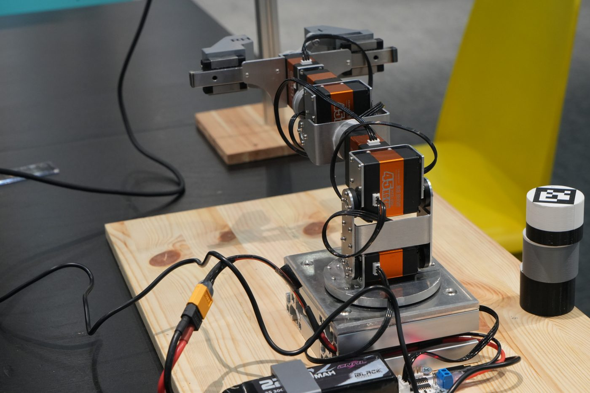
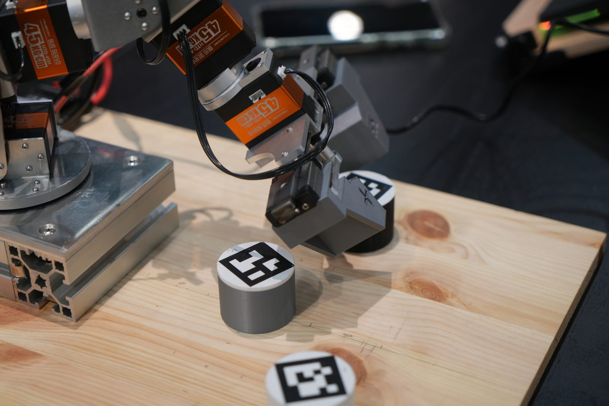
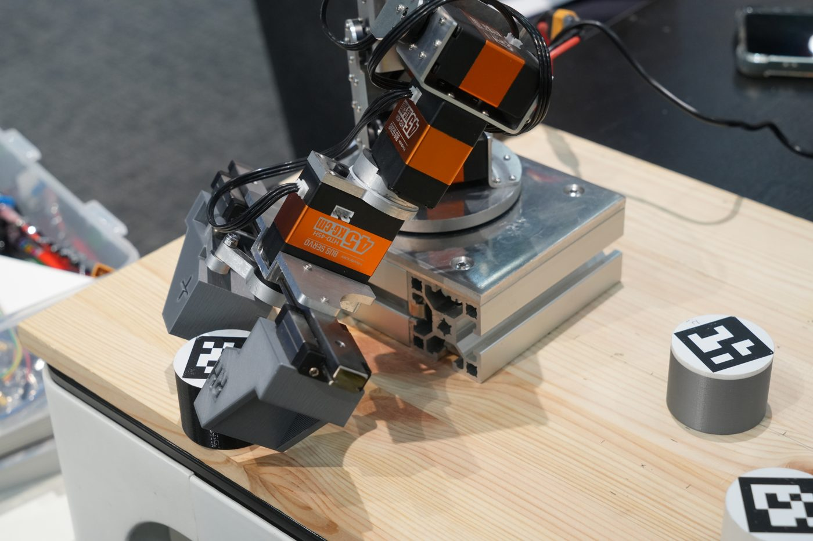

# 7-DoF Manipulator

!!! abstract "요약"
    - 휴머노이드 이전 단계로 만든 7축 로봇팔 (6축 + 그리퍼) — 2025년 3~7월
    - MoveIt2 + MoveIt Task Constructor(MTC)로 **"집기 → 옮기기 → 놓기"를 단계별로 계획**
    - 최종 결과: 카메라로 AprilTag 실린더 3개를 찾아 **3층으로 쌓기**
    - 여기서 만든 하드웨어 인터페이스가 [휴머노이드 Hardware Interface](../hw/index.md)의 원형

<div class="video-wrap">
  <iframe src="https://www.youtube.com/embed/ORmjhn7OqBc" title="2025.06.05 로보인 제어 세미나 : 7축 로봇팔 시연영상" allow="accelerometer; clipboard-write; encrypted-media; gyroscope; picture-in-picture; web-share" referrerpolicy="strict-origin-when-cross-origin" allowfullscreen></iframe>
</div>

## 구조

```text
 웹캠 → rhp_apriltag_ros2 ──/apriltag_detections──▶ vision_cylinder_stack (MTC Task)
                                                          │ plan → execute
                                                          ▼
                                     move_group (+ ExecuteTaskSolutionCapability)
                                                          │ FollowJointTrajectory
                                     ┌────────────────────┴────────────────────┐
                                     ▼                                         ▼
                              arm_controller (6축)                     hand_controller (1축)
                                     └───────────── controller_manager ─────────┘
                                                          │
                                         rhparm_hardware_interface (/dev/ttyUSB0)
                                                          ▼
                                         Hiwonder HTD-45H 서보 × 7
```

<div class="photo-row" markdown>

<figure markdown="span">
  
  <figcaption>7축 로봇팔 (6축 + 그리퍼)</figcaption>
</figure>

<figure markdown="span">
  
  <figcaption>AprilTag 실린더 파지</figcaption>
</figure>

<figure markdown="span">
  
  <figcaption>3층 적층</figcaption>
</figure>

</div>

## 목표 과제와 상태

| 과제 | 내용 | 상태 |
|---|---|---|
| 원격 조종 | 키보드 입력으로 조종, 카메라 영상 원격 스트리밍 | 구현 기록 없음 |
| 공 Pick & Place | 바닥의 공 위치를 검출해 잡고 지정 위치에 놓기, 실패 시 재시도 | 공 작업 기록 없음. **실린더** Pick & Place로 구현 (좌표 입력 → 카메라 검출) |
| 블럭 쌓기 | 태그로 순서를 읽어 정해진 순서대로 쌓기 | **구현** — AprilTag 실린더 3층 적층 → [Pick & Place](pick-place.md) |

## 로봇팔 구성

| 항목 | 값 |
|---|---|
| 관절 | `revolute_1` ~ `revolute_6` (회전) + `slider_1` (그리퍼, 직선) |
| 모터 | Hiwonder HTD-45H × 7 (ID 1~7) |
| Planning group | `arm` (base_link → gripper_base), `hand` (그리퍼), `arm_hand` |
| End effector | `gripper_base` |
| 그리퍼 자세 | `open` = 0.03 m, `close` = 0.00 m |

## 패키지

**[`RHp_arm_resources`](https://github.com/RHplusLab/RHp_arm_resources)** — 로봇 모델 · 하드웨어

| 패키지 | 역할 |
|---|---|
| `rhparm_description` | URDF/xacro, 메시, RViz · Gazebo launch |
| `rhparm_hardware_interface` | ros2_control 하드웨어 플러그인 (휴머노이드 인터페이스의 원형) |
| `rhparm_moveit_config` | MoveIt Setup Assistant 결과물: SRDF, 컨트롤러, 키네마틱스 설정 → [MoveIt2 Basics](moveit2.md) |

**[`RHp_arm_controller`](https://github.com/RHplusLab/RHp_arm_controller)** — 작업 노드

| 패키지 | 역할 |
|---|---|
| `rhparm_mtc_pick_and_place` | MTC 작업 노드와 launch → [MoveIt Task Constructor](mtc.md), [Pick & Place](pick-place.md) |

**비전 (제어 연동 지점)** — [`RHp_apriltag_ros2`](https://github.com/RHplusLab/RHp_apriltag_ros2) · `RHp_apriltag_msgs` → [AprilTag Integration](apriltag.md)

## 실행

```bash
sudo chmod 766 /dev/ttyUSB0                       # 실제 로봇일 때 포트 권한

# 1) MoveIt + 컨트롤러 + RViz
ros2 launch rhparm_mtc_pick_and_place mtc_demo.launch.py                                   # 시뮬레이션
ros2 launch rhparm_mtc_pick_and_place mtc_demo.launch.py ros2_control_hardware_type:=real  # 실제 로봇

# 2) 작업 노드 (새 터미널)
ros2 launch rhparm_mtc_pick_and_place fixed_void.launch.py
```

| `ros2_control_hardware_type` | 하드웨어 플러그인 |
|---|---|
| `fake` (기본) | `mock_components/GenericSystem` — 명령값을 그대로 상태로 돌려줌 |
| `real` | `rhparm_hardware/RHPArmSystemHardware` — 실제 서보 구동 |

## 단계별 구현 (브랜치)

각 단계가 [`RHp_arm_controller`](https://github.com/RHplusLab/RHp_arm_controller/branches) 브랜치로 남아 있다. 앞 단계 코드를 복사해 하나씩 기능을 더하는 방식이다.

| 단계 | 브랜치 | 실행 파일 | 추가된 것 |
|---|---|---|---|
| 1 | `main` | `fixed_void` | MTC 튜토리얼을 우리 로봇에 맞춘 기본 pick & place |
| 2 | `centor_cylinder` | `center_cylinder` | 그리퍼 기울기(쿼터니언) 조정, 지정 위치에 놓고 원위치 복귀 |
| 3 | `diagonal_cylinder` | `diagonal_cylinder`, `center_cylinder_2cm/4cm` | 대각선 위치 물체, 실린더 크기별 파지 폭 |
| 4 | `arbitary_cylinder` | `arbitrary_cylinder(_level, _stack)` | launch 인자로 임의 좌표 입력, 거리별 접근 각도, 3층 적층 |
| 5 | `vision_cylinder` | `vision_cylinder_one`, `vision_cylinder_stack` | AprilTag 좌표를 받아 1개 / 3개 적층 |

## 학습 순서

1. [MoveIt2 Basics](moveit2.md) — RViz에서 손으로 계획 · 실행, 설정 파일 구조
2. [MoveIt Task Constructor](mtc.md) — 단계(stage)로 작업 쪼개기, `fixed_void` 읽기
3. [Pick & Place](pick-place.md) — 임의 좌표 → 3층 적층
4. [AprilTag Integration](apriltag.md) — 카메라 좌표를 로봇 좌표로 바꿔 작업에 연결

## 참고 자료

- [MoveIt 2 Humble 문서](https://moveit.picknik.ai/humble/index.html)
- [MoveIt Task Constructor 개념](https://moveit.picknik.ai/main/doc/concepts/moveit_task_constructor/moveit_task_constructor.html)
- [오로카 ROS 2 강좌](https://cafe.naver.com/openrt/24070) — ROS2 기초
