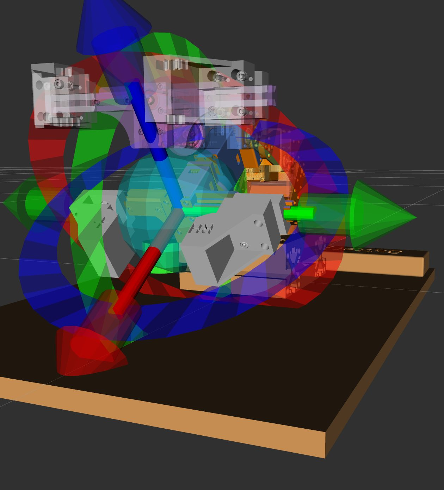

# MoveIt2 Basics

!!! abstract "요약"
    - MoveIt2: 목표 자세만 주면 **충돌 없는 관절 궤적을 계획**하고 ros2_control 컨트롤러로 실행
    - 로봇마다 필요한 설정은 `*_moveit_config` 패키지 하나에 모인다 (Setup Assistant로 생성)
    - 이 페이지: RViz 사용법 → 설정 파일 구조 → C++에서 호출하기

## 1. 튜토리얼

| 순서 | 문서 | 내용 |
|---|---|---|
| 1 | [Quickstart in RViz](https://moveit.picknik.ai/humble/doc/tutorials/quickstart_in_rviz/quickstart_in_rviz_tutorial.html) | Panda 로봇으로 RViz에서 계획 · 실행 |
| 2 | [Your First C++ MoveIt Project](https://moveit.picknik.ai/humble/doc/tutorials/your_first_project/your_first_project.html) | `MoveGroupInterface`로 목표 자세 지정 |
| 3 | [MoveIt Task Constructor](https://moveit.picknik.ai/main/doc/concepts/moveit_task_constructor/moveit_task_constructor.html) | 다단계 작업 → [다음 페이지](mtc.md) |

```bash
ros2 launch moveit2_tutorials demo.launch.py rviz_config:=panda_moveit_config_demo_empty.rviz
```

## 2. RViz MotionPlanning 패널

<figure markdown="span">
  { width="520" }
  <figcaption>인터랙티브 마커로 끝단 목표 자세 지정</figcaption>
</figure>

| 기능 | 위치 | 용도 |
|---|---|---|
| Planning Group | Planning Request | 움직일 관절 묶음 선택 (`arm` / `hand`) |
| 인터랙티브 마커 | 3D 뷰 | 화살표 · 고리를 끌어 목표 자세 지정 |
| Plan / Execute | Planning 탭 | 계획 확인 후 실행 |
| Use Cartesian Path | Planning 탭 | 끝단을 직선 경로로 이동 |
| Velocity / Accel. Scaling | Planning 탭 | 실행 속도 조절 |
| Show Trail | Displays › Planned Path | 이동 경로 잔상 표시 |
| Trajectory Slider | Panels | 계획된 궤적을 프레임 단위로 확인 |
| Save Config | File | 화면 · 패널 배치를 `.rviz`로 저장 |

## 3. moveit_config 패키지 구조

[`rhparm_moveit_config`](https://github.com/RHplusLab/RHp_arm_resources/tree/main/rhparm_moveit_config) 기준

| 파일 | 내용 | 수정 |
|---|---|---|
| `rhparm.urdf.xacro` | description의 URDF + ros2_control 태그를 합친 최종 모델 | 거의 없음 |
| `rhparm.srdf` | planning group, 기본 자세, end effector, 충돌 무시 쌍 | 그룹 · 자세 추가 시 |
| `rhparm.ros2_control.xacro` | 하드웨어 플러그인 선택 (`fake` / `real`) | 하드웨어 변경 시 |
| `ros2_controllers.yaml` | ros2_control 쪽 컨트롤러 정의 | 관절 추가 시 |
| `moveit_controllers.yaml` | MoveIt이 궤적을 보낼 컨트롤러 목록 | 관절 추가 시 |
| `kinematics.yaml` | IK 솔버 (KDL) | 거의 없음 |
| `joint_limits.yaml` | 속도 · 가속도 한계 | 속도 조정 시 |
| `initial_positions.yaml` | 시작 관절값 (fake 하드웨어용) | — |
| `ompl_planning.yaml` | 경로 계획기 설정 | 거의 없음 |

### SRDF

```xml
<group name="arm">
  <chain base_link="base_link" tip_link="gripper_base"/>
</group>
<group name="hand">
  <joint name="slider_1"/> <joint name="slider_2"/>
</group>

<group_state name="rest"  group="arm">  <!-- 전 관절 0 --> </group_state>
<group_state name="open"  group="hand"> <joint name="slider_1" value="0.03"/> </group_state>
<group_state name="close" group="hand"> <joint name="slider_1" value="0.00"/> </group_state>

<end_effector name="end_effector" parent_link="gripper_base" group="hand" parent_group="arm"/>
<virtual_joint name="virtual_joint" type="fixed" parent_frame="world" child_link="base_link"/>
```

- `group_state` 이름(`rest`, `open`, `close`)은 코드에서 `setGoal("open")`처럼 그대로 쓴다.
- `disable_collisions`: 붙어 있어 항상 닿는 링크 쌍. Setup Assistant의 Self-Collisions 단계가 자동 생성한다.

### 컨트롤러 파일 두 개

이름이 비슷해 헷갈리지만 역할이 다르다. **관절 이름과 개수가 두 파일, 그리고 ros2_control 태그에서 모두 같아야 한다.**

| | `ros2_controllers.yaml` | `moveit_controllers.yaml` |
|---|---|---|
| 읽는 쪽 | controller_manager | move_group |
| 내용 | 컨트롤러 종류 · 관절 · 인터페이스 | 궤적을 보낼 action 이름 · 관절 |
| 컨트롤러 | `arm_controller`, `hand_controller` (JointTrajectoryController), `joint_state_broadcaster` | `arm_controller`, `hand_controller` (`FollowJointTrajectory`) |

```yaml
# ros2_controllers.yaml
controller_manager:
  ros__parameters:
    update_rate: 100
    arm_controller:  { type: joint_trajectory_controller/JointTrajectoryController }
    hand_controller: { type: joint_trajectory_controller/JointTrajectoryController }
    joint_state_broadcaster: { type: joint_state_broadcaster/JointStateBroadcaster }
```

### 하드웨어 선택

```xml
<xacro:if value="${ros2_control_hardware_type == 'fake'}">
  <plugin>mock_components/GenericSystem</plugin>
</xacro:if>
<xacro:if value="${ros2_control_hardware_type == 'real'}">
  <plugin>rhparm_hardware/RHPArmSystemHardware</plugin>
</xacro:if>
```

launch 인자 `ros2_control_hardware_type:=real` 하나로 시뮬레이션과 실물이 바뀐다.

## 4. 그리퍼: 각도 ↔ 거리 변환

- MoveIt은 그리퍼를 **직선 관절**(`slider_1`, 단위 m)로 다룬다.
- 실제 그리퍼는 **서보 1개의 회전**을 링크 기구로 벌림 폭으로 바꾼다.
- 변환은 하드웨어 인터페이스(`rhparm.cpp`)에서 한다. 상수 A~D는 링크 치수(m).

```cpp
#define A 0.026000
#define B 0.031000
#define C 0.010048
#define D 0.001552

// 서보 각도(rad) → 벌림 거리(m)
position = sqrt(B*B - pow(A*cos(angle) - C, 2)) + A*sin(angle) - sqrt(B*B - pow(A - C, 2)) + D;
```

!!! warning "`close`를 그대로 쓰지 않는다"
    `close`(0.00 m)는 물체를 끝까지 조여 그리퍼가 상한다. 물체 지름에 맞춘 값을 직접 준다.

    ```cpp
    stage->setGoal(std::map<std::string, double>{{"slider_1", 0.019}});  // 실린더 파지
    ```

## 5. C++에서 호출: MoveGroupInterface

MTC 없이 한 번만 움직일 때. 예: 카메라가 바닥을 보도록 팔을 세우는 [`vision_prepare.cpp`](https://github.com/RHplusLab/RHp_arm_controller/blob/vision_cylinder/rhparm_mtc_pick_and_place/src/vision_prepare.cpp)

```cpp
auto node = std::make_shared<rclcpp::Node>("simple_joint_move_node",
    rclcpp::NodeOptions().automatically_declare_parameters_from_overrides(true));

rclcpp::executors::SingleThreadedExecutor executor;      // 별도 스레드에서 spin 필수
executor.add_node(node);
std::thread spin_thread([&executor]() { executor.spin(); });

moveit::planning_interface::MoveGroupInterface arm(node, "arm");   // SRDF 그룹 이름
auto joints = arm.getCurrentJointValues();
joints[2] = -M_PI * 4.0 / 12.0;                                     // 3번 관절 -60°
arm.setJointValueTarget(joints);

moveit::planning_interface::MoveGroupInterface::Plan plan;
if (arm.plan(plan) == moveit::core::MoveItErrorCode::SUCCESS) {
  arm.move();
}
```

## 트러블슈팅

| 증상 | 원인 | 해결 |
|---|---|---|
| `ros2 launch`로 띄운 노드에서 `std::cin` 입력이 안 됨 | launch는 표준 입력을 연결하지 않음 | 좌표 등은 **launch 인자**로 받는다 (`x_coord:=0.15`) |
| `ros2 run`으로 실행 시 `Task failed to construct RobotModel` | `robot_description` · `robot_description_semantic` 파라미터 없음 | launch 파일에서 `MoveItConfigsBuilder("rhparm").to_dict()`를 파라미터로 넘긴다 |
| 일부 토픽 이름에 `~/`가 붙어 연결 안 됨 | 바이너리 패키지의 토픽 이름 규칙 | launch에서 `remappings=[("~/robot_description", "/robot_description")]` |
| VS Code에서 MoveIt 헤더를 못 찾음 (빨간 줄) | `includePath` 누락 | `c_cpp_properties.json`에 `/opt/ros/humble/include/**`, `~/ws_moveit2/**` 추가 |
