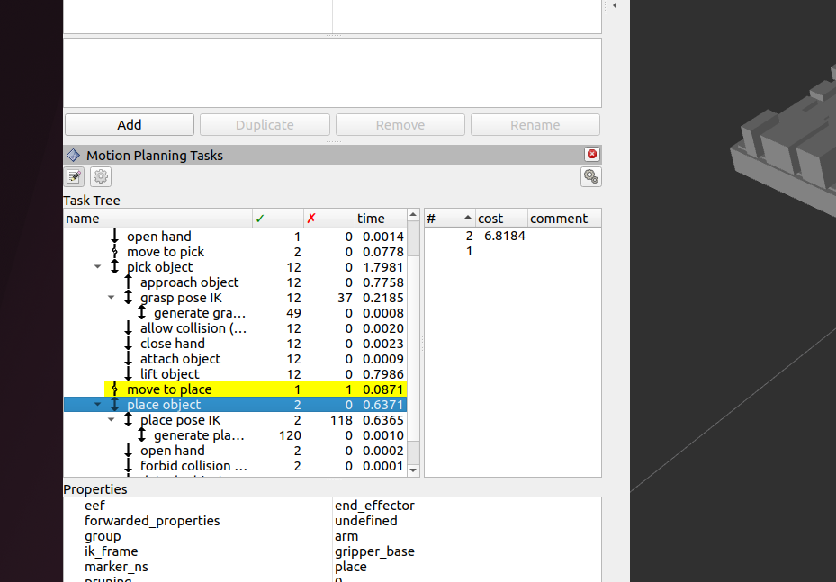
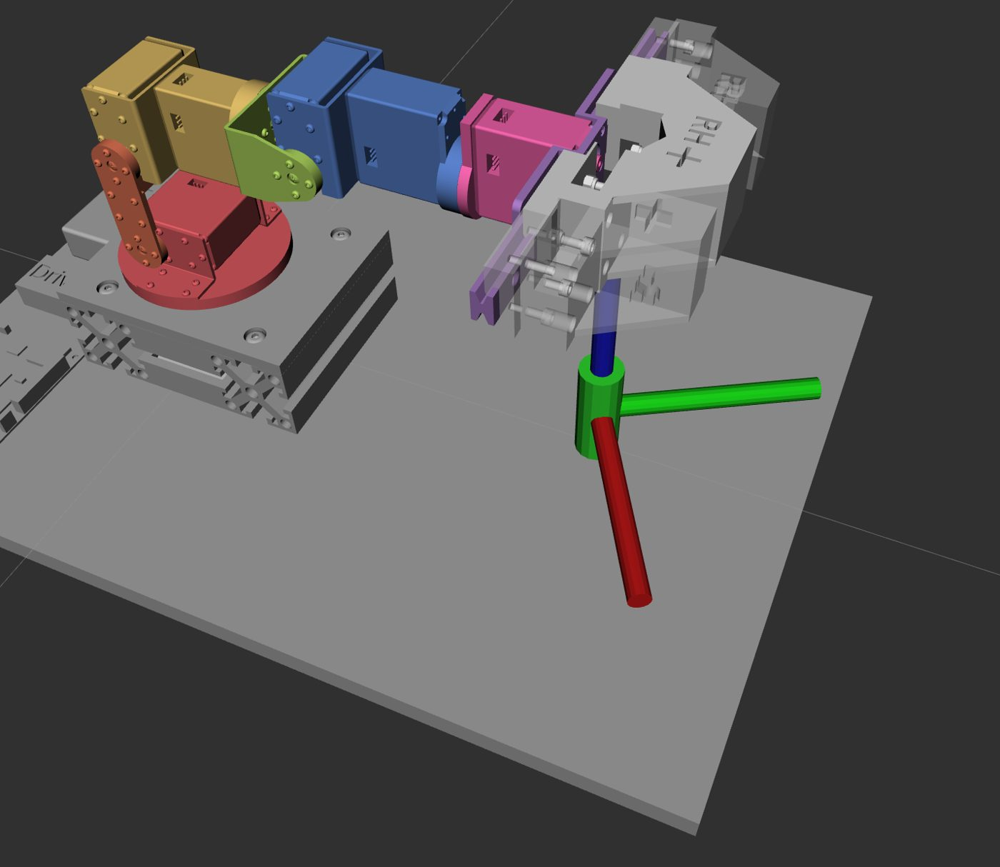

# MoveIt Task Constructor

!!! abstract "요약"
    - MTC: 복잡한 작업을 **단계(stage)의 연결**로 표현하고, 단계마다 여러 해를 만들어 이어지는 조합을 찾는 프레임워크
    - Pick & Place = 손 펴기 → 접근 → 잡기 → 들기 → 이동 → 놓기 → 빠지기
    - 기준 코드: [`fixed_void.cpp`](https://github.com/RHplusLab/RHp_arm_controller/blob/main/rhparm_mtc_pick_and_place/src/fixed_void.cpp)

## 설치 (소스 빌드)

```bash
mkdir -p ~/ws_moveit2/src && cd ~/ws_moveit2/src
git clone https://github.com/ros-planning/moveit_task_constructor.git -b humble

cd ~/ws_moveit2
colcon build --mixin release        # colcon mixin 사전 설정 필요 → Installation 참고
echo "source ~/ws_moveit2/install/local_setup.bash" >> ~/.bashrc
```

## 1. 단계(stage)의 세 종류

<figure markdown="span">
  { width="520" }
  <figcaption>RViz Motion Planning Tasks 패널 — 단계별 해 개수 · 비용</figcaption>
</figure>

| 종류 | 하는 일 | 대표 stage |
|---|---|---|
| **Generator** | 앞뒤와 무관하게 스스로 상태를 만든다 | `CurrentState`, `GenerateGraspPose`, `GeneratePlacePose` |
| **Propagator** | 앞(또는 뒤) 단계의 결과를 받아 다음 상태를 만든다 | `MoveTo`, `MoveRelative`, `ModifyPlanningScene` |
| **Connector** | 앞뒤 두 상태 사이를 잇는 경로를 계획한다 | `Connect` |

| 구성 요소 | 설명 |
|---|---|
| **Wrapper** `ComputeIK` | Generator가 낸 끝단 자세(직교 좌표)를 관절각으로 바꿔 준다 |
| **Container** `SerialContainer` | 단계를 순서대로 묶음 (`pick object`, `place object`) |
| **Container** `Parallel` | 여러 대안을 병렬로 시도하고 좋은 해를 고름 (미사용) |

**Task Tree 패널 읽기**

- ✓ 열: 그 단계에서 찾은 해 개수 / ✗ 열: 실패한 시도 수
- cost: 낮을수록 좋은 해 (이동 거리 등)
- 화살표: 해가 전파되는 방향. 양방향은 Generator, 단방향은 Propagator

## 2. Pick & Place 작업 구조

```text
demo task
├─ current                         CurrentState
├─ open hand                       MoveTo(hand, "open")          JointInterpolation
├─ move to pick                    Connect(arm)                  OMPL
├─ pick object                     SerialContainer
│   ├─ approach object             MoveRelative(+x 방향 2~20 cm)  Cartesian
│   ├─ grasp pose IK               ComputeIK
│   │   └─ generate grasp pose     GenerateGraspPose (π/24 간격 회전 샘플링)
│   ├─ allow collision (hand,obj)  ModifyPlanningScene
│   ├─ close hand                  MoveTo(hand, "close")
│   ├─ attach object               ModifyPlanningScene
│   └─ lift object                 MoveRelative(+z 방향 2~20 cm)
├─ move to place                   Connect(arm, hand)            OMPL
└─ place object                    SerialContainer
    ├─ place pose IK               ComputeIK
    │   └─ generate place pose     GeneratePlacePose
    ├─ open hand                   MoveTo(hand, "open")
    ├─ forbid collision (hand,obj) ModifyPlanningScene
    ├─ detach object               ModifyPlanningScene
    └─ retreat                     MoveRelative(-z 방향)
```

**Planner 세 가지**

| Planner | 용도 | 코드 |
|---|---|---|
| `PipelinePlanner` | 장애물 회피 경로 (OMPL 샘플링) — 큰 이동 | `std::make_shared<mtc::solvers::PipelinePlanner>(node_)` |
| `JointInterpolationPlanner` | 관절 공간 직선 보간 — 그리퍼 열고 닫기 | `std::make_shared<mtc::solvers::JointInterpolationPlanner>()` |
| `CartesianPath` | 끝단 직선 이동 — 접근 · 들기 · 빠지기 | `std::make_shared<mtc::solvers::CartesianPath>()` |

## 3. 코드 구조

| 함수 | 역할 | 수정 빈도 |
|---|---|---|
| `setupPlanningScene()` | 물체(충돌 객체)의 모양 · 크기 · 위치 등록 | **높음** |
| `createTask()` | 위 stage들을 조립 | **높음** |
| `doTask()` | `init()` → `plan()` → `execute()` | 낮음 |

<figure markdown="span">
  { width="480" }
  <figcaption>planning scene에 등록한 실린더 (초록)</figcaption>
</figure>

### 물체 등록

```cpp
moveit_msgs::msg::CollisionObject object;
object.id = "object";                                   // 물체마다 고유 id
object.header.frame_id = "world";
object.primitives.resize(1);
object.primitives[0].type = shape_msgs::msg::SolidPrimitive::CYLINDER;
object.primitives[0].dimensions = { 0.03, 0.02 };        // { 높이, 반지름 } (m)

geometry_msgs::msg::Pose pose;
pose.position.x = 0.20;
pose.position.z = 0.03 / 2 + 0.001;                      // 바닥에서 1 mm 띄움
pose.orientation.w = 1.0;
object.pose = pose;

moveit::planning_interface::PlanningSceneInterface().applyCollisionObject(object);
```

### 잡는 자세

```cpp
auto stage = std::make_unique<mtc::stages::GenerateGraspPose>("generate grasp pose");
stage->setPreGraspPose("open");
stage->setObject("object");
stage->setAngleDelta(M_PI / 24);                 // 물체 z축 둘레로 7.5°씩 후보 생성
stage->setMonitoredStage(current_state_ptr);

Eigen::Isometry3d grasp_frame_transform = Eigen::Isometry3d::Identity();
grasp_frame_transform.linear() =
    Eigen::AngleAxisd(-angle_deg * M_PI / 180.0, Eigen::Vector3d::UnitY()).toRotationMatrix();  // 그리퍼 기울기
grasp_frame_transform.translation().x() = 0.055; // gripper_base → 손가락 중심 거리

auto wrapper = std::make_unique<mtc::stages::ComputeIK>("grasp pose IK", std::move(stage));
wrapper->setMaxIKSolutions(8);
wrapper->setIKFrame(grasp_frame_transform, "gripper_base");
```

- 기울기(y축 회전)가 없으면 그리퍼가 항상 수평으로만 접근한다. 바닥의 낮은 물체는 **위에서 비스듬히** 잡아야 해가 나온다.
- 기울기는 물체까지의 거리에 따라 달라진다 → [Pick & Place § 접근 각도](pick-place.md#approach-angle)

### 계획 · 실행

```cpp
task_.init();
if (!task_.plan(5)) {                                    // 해를 최대 5개까지 찾음
  RCLCPP_ERROR(LOGGER, "Task planning failed");
  return;
}
task_.introspection().publishSolution(*task_.solutions().front());   // RViz에 표시
task_.execute(*task_.solutions().front());               // 가장 좋은 해 실행
```

### launch 필수 설정

`move_group`에 **MTC 실행 기능**을 켜야 `execute()`가 동작한다.

```python
run_move_group_node = Node(
    package="moveit_ros_move_group",
    executable="move_group",
    parameters=[moveit_config.to_dict(),
                {"capabilities": "move_group/ExecuteTaskSolutionCapability"}],
)
```

RViz에는 **Motion Planning Tasks** 패널을 추가한다 (`mtc.rviz`에 저장되어 있음).

## 트러블슈팅

| 증상 | 원인 | 해결 |
|---|---|---|
| `allow collision (hand,object)`에서 해 없음 | 물체가 바닥(`base_link` 판)과 붙어 있어 충돌로 판정 | 물체를 바닥에서 1 mm 띄우거나 `allowCollisions`에 `base_link` 추가 |
| 물체 여러 개일 때 `generate grasp pose`부터 실패 | 모든 물체의 `id`가 같음 | `object1`, `object2`… 고유 id 부여 |
| 실린더 높이를 줄이니 실패 | 그리퍼가 바닥 판과 충돌 | 실린더 높이 2 cm → **3 cm** |
| `Connect`(move to place)에서 해가 잘 안 나옴 | 샘플링 기반이라 실행마다 결과가 다름 | `plan()` 실패 시 1초 쉬고 재시도 (`vision_cylinder_stack`은 **최대 10회**), `MoveRelative` 최소 거리 3 → 5 mm |
| 3층 쌓기에서 경로가 2층 실린더를 관통 | 놓인 실린더를 장애물로 등록하지 않음 | 쌓인 실린더를 충돌 객체로 추가 |
| 원위치 복귀에서 충돌 | `JointInterpolationPlanner`는 장애물을 보지 않음 | 복귀(`return home`)는 `PipelinePlanner`(sampling) 사용 |
| `MoveRelative`가 원하는 만큼 못 감 | `setMinMaxDistance`의 최소값을 만족 못 함 | 최소 거리를 줄이거나 방향 벡터 확인 |
