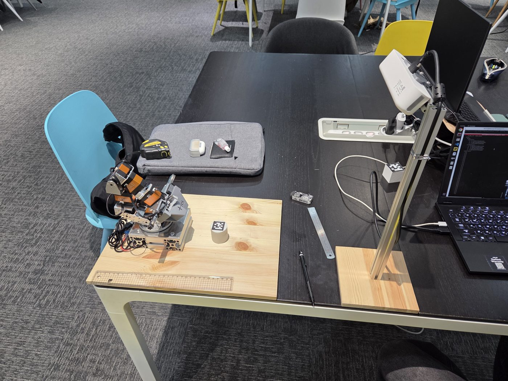
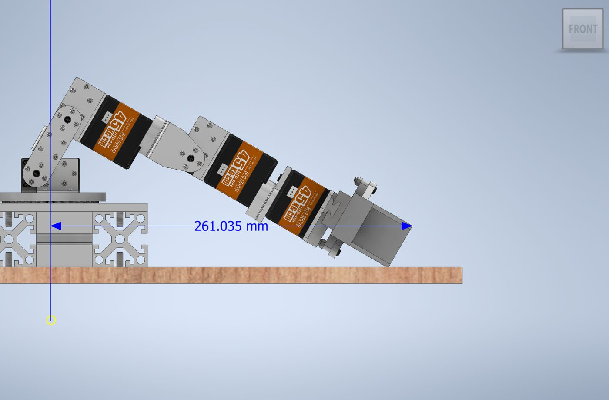
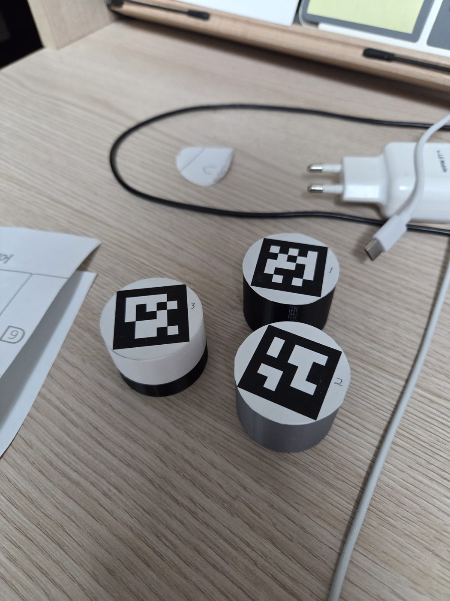

# Pick & Place

!!! abstract "요약"
    - 목표: 바닥에 흩어진 AprilTag 실린더 3개를 카메라로 찾아 **한 위치에 3층으로 쌓기**
    - 핵심: 물체까지의 **거리에 따라 그리퍼 접근 각도를 바꾸는** 표(lookup table)
    - 소스: [`vision_cylinder` 브랜치](https://github.com/RHplusLab/RHp_arm_controller/tree/vision_cylinder/rhparm_mtc_pick_and_place)

<div class="photo-row photo-row--portrait-last" markdown>

<figure markdown="span">
  
  <figcaption>작업대 위 웹캠 · 로봇팔 배치</figcaption>
</figure>

<figure markdown="span">
  
  <figcaption>Inventor로 자세별 도달 거리 측정</figcaption>
</figure>

<figure markdown="span">
  { .portrait }
  <figcaption>AprilTag 실린더 (ID 1~3)</figcaption>
</figure>

</div>

## 작업 조건

| 항목 | 값 |
|---|---|
| 실린더 | 높이 3 cm, 반지름 2 cm, 윗면에 AprilTag (`tag25h9`) |
| 순서 | 검출 메시지에 담긴 순서대로 1층 → 2층 → 3층 (태그 ID 1~3 사용) |
| 쌓는 위치 | `(x, y) = (0, -0.13)` — 로봇 기준 정오른쪽 13 cm 고정 |
| 층별 높이 | `z = 높이 × (층 - 0.5)` → 1.5 / 4.5 / 7.5 cm |
| 그리퍼 파지 폭 | `slider_1 = 0.019` m |

## 실행

```bash
# 터미널 1: MoveIt + 컨트롤러 + RViz (실제 로봇)
sudo chmod 766 /dev/ttyUSB0
ros2 launch rhparm_mtc_pick_and_place mtc_demo.launch.py ros2_control_hardware_type:=real

# 터미널 2: 팔을 세워 카메라 시야 확보
ros2 launch rhparm_mtc_pick_and_place vision_prepare.launch.py

# 터미널 3: AprilTag 검출 → /apriltag_detections
ros2 launch rhp_apriltag_ros2 apriltag_webcam.launch.py

# 터미널 4 (선택): 실린더 배치가 도달 범위 안인지 확인
ros2 run rhparm_mtc_pick_and_place apriltag_processor_node
#   ID:1 x:0.150 y:-0.050 z:0.015 dist:0.158 O  |  ID:2 ... X

# 터미널 5: 적층 실행
ros2 launch rhparm_mtc_pick_and_place vision_cylinder_stack.launch.py
```

`vision_cylinder_stack` 동작 순서

1. 3초 카운트다운 후 `/apriltag_detections` 구독
2. 태그 3개를 받으면 구독 해제 → 거리 계산 → 층별 접근 각도 결정
3. 실린더 3개를 planning scene에 등록
4. 1층 → 2층 → 3층 순서로 각각 MTC 작업 생성 · 계획 · 실행 (3층 뒤에만 `rest` 자세로 복귀)

카메라 좌표 → 로봇 좌표 변환(캘리브레이션)은 [AprilTag Integration](apriltag.md)에서 다룬다.

## 접근 각도 표 { #approach-angle }

바닥의 낮은 물체는 그리퍼를 기울여 위에서 비스듬히 잡아야 한다.
**가까운 물체는 세워서, 먼 물체는 눕혀서** 잡는다. 놓는 높이(층)가 높을수록 같은 거리에서도 더 눕혀야 한다.

거리 $d = \sqrt{x^2 + y^2}$ (로봇 원점 기준, m) → 접근 각도 (°)

| 1층 | | 2층 | | 3층 | |
|---|---|---|---|---|---|
| **거리** | **각도** | **거리** | **각도** | **거리** | **각도** |
| 0.100 – 0.145 | 70 | 0.120 – 0.175 | 60 | 0.135 – 0.200 | 50 |
| 0.145 – 0.160 | 65 | 0.175 – 0.195 | 55 | 0.200 – 0.220 | 45 |
| 0.160 – 0.180 | 60 | 0.195 – 0.210 | 50 | 0.220 – 0.230 | 40 |
| 0.180 – 0.210 | 55 | 0.210 – 0.225 | 45 | 0.230 – 0.260 | 37 |
| | | 0.225 – 0.245 | 35 | | |
| | | 0.245 – 0.265 | 26 | | |

- 범위를 벗어나면 노드를 종료한다 → 실린더를 다시 배치
- 2 · 3층에서 각도가 40° 미만이면 잡는 점을 6 mm 내린다 (`z_down`), 그 외 3 mm

```cpp
grasp_frame_transform.translation().x() = 0.055;
grasp_frame_transform.translation().z() = (level >= 2 && angle < 40) ? -0.006 : -0.003;
```

### 표를 만드는 방법

1. **Inventor로 대략적인 범위** — 조립 모델에서 그리퍼 각도를 바꿔 가며 끝단 거리 측정
2. **시뮬레이션으로 확인** — 좌표 · 각도 · 층을 launch 인자로 넣어 한 칸씩 성공 여부 확인

    ```bash
    ros2 launch rhparm_mtc_pick_and_place arbitrary_cylinder_level.launch.py \
        x_coord:=0.17 y_coord:=0.0 angle:=60.0 level:=2
    ```

3. **끝단 각도 측정 노드** — `end_effector_subscriber`가 TF(`link6` → `gripper_base`)를 읽어 실제 기울기 출력

    - 손가락 중심 = `link6` 기준 $(0.0464 + 0.055,\ 0,\ 0.0201)$ m
    - 쿼터니언 $(x, y, z, w)$ → 회전행렬의 z축 성분 → 지면과의 각도

    $$
    \theta = \cos^{-1}\left(1 - 2x^2 - 2y^2\right)
    $$

4. 같은 각도로 성공하는 거리 구간을 묶어 `if` 문으로 정리

| 층 | 도달 가능 거리 (시뮬레이션) |
|---|---|
| 1층 | 10 ~ 21 cm |
| 2층 | 12 ~ 26.5 cm |
| 3층 | 13.5 ~ 27 cm |

## 적층 단계 추가

[기본 Pick & Place](mtc.md#2-pick-place)에 아래를 더했다.

| 위치 | 추가 stage / 설정 | 이유 |
|---|---|---|
| `place object` 맨 앞 | `descend object` — `MoveRelative(-z, 1~20 cm)` | 위에서 수직으로 내려놓아 아래 실린더를 밀지 않음 |
| `close hand` | 목표값 `slider_1 = 0.019` | `close`(0)로 조이면 그리퍼 손상 |
| 마지막 층 뒤 | `return home` — `MoveTo("rest")`, sampling planner | 장애물(쌓인 탑)을 피해 복귀 |
| 층별 작업 | 층마다 Task를 새로 만들고 실패 시 재시도 | 한 Task로 3층을 묶으면 중간 `Connect`에서 해가 잘 안 나옴 |

## 트러블슈팅

| 증상 | 원인 | 해결 |
|---|---|---|
| 태그 ID가 0부터라고 가정했는데 동작 안 함 | 출력한 태그가 1번부터 | ID 1~3 기준으로 처리 |
| 콜백 안에서 노드가 바로 끝남 | 콜백에 `rclcpp::shutdown()` | 작업이 끝난 뒤 종료 |
| `failed to create guard condition: the given context is not valid` | 종료된 컨텍스트에서 노드 재사용 | shutdown 위치 정리 (위와 동일) |
| 실물이 시뮬레이션보다 고개를 더 숙임 | 서보 자중 처짐 · 조립 오차 | 하드웨어 인터페이스에서 관절별 서보값 보정 (예: 2번 +6, 3번 −5, 5번 −3) |
| 태그 1개만 놓으면 거리 판정이 틀어짐 | 원인 미확인 (3개일 때는 정상) | 항상 3개를 배치해 실행 |
