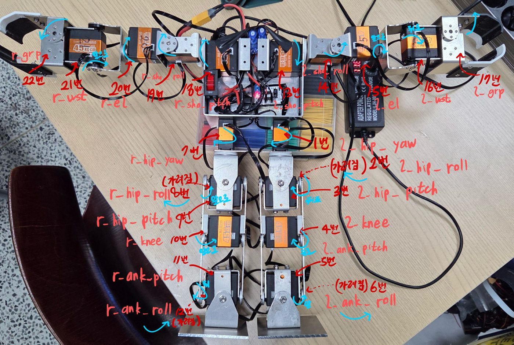

# Robot Description

!!! abstract "요약"
    - 입력: 하드웨어팀 Inventor 조립 파일 [`RHp_Humanoid_ver1`](https://github.com/RHplusLab/RHp_Humanoid_ver1)
    - 출력: [`rhphumanoid_description`](https://github.com/RHplusLab/RHp_humanoid_resources/tree/main/rhphumanoid_description) 패키지
    - 흐름: `.iam` → 링크별 `.stl` → 물리값 · 관절 위치 측정 → xacro → RViz 확인

## 패키지 구조

```text
rhphumanoid_description/
├── meshes/                          링크별 .stl
├── urdf/
│   ├── rhphumanoid.urdf.xacro               최상위 (나머지 include)
│   ├── rhphumanoid.visuals.xacro            mesh · color
│   ├── rhphumanoid.inertia.xacro            질량 · 무게중심 · 관성
│   ├── rhphumanoid.structure.*.xacro        lleg / rleg / larm / rarm / head
│   ├── rhphumanoid.transmissions.xacro
│   └── rhphumanoid.gazebo.xacro             use_gazebo:=true 일 때만
├── ros2_control/
│   └── rhphumanoid.ros2_control.xacro       하드웨어 플러그인 선택
├── doc/rhphumanoid_sim.ods                  물리값 기록표
├── launch/rhphumanoid_display.launch.py
└── rviz/rhphumanoid.rviz
```

## 1. 메시

**규칙**

| 항목 | 기준 |
|---|---|
| 묶는 단위 | 함께 움직이는 부품 전체 → `.stl` 1개 |
| 원점 위치 | Proximal Joint (몸통 쪽 관절) |
| 원점 높이 | 모터 Top Horn 안쪽 원 |
| 좌표축 | 앞 +X, 왼쪽 +Y, 위 +Z |
| 파일명 | `body`, 다리 `ll1~6` · `rl1~6`, 팔 `la1~5` · `ra1~5` (몸통에서 먼 쪽으로 번호 증가) |

**Inventor 내보내기**

1. `.iam` 열기 (`body` · `leg` · `arm` 브랜치)
2. 묶을 부품 선택 → **우클릭 › Component › Demote**
3. 새로 생긴 파트 더블클릭
4. 핀 아이콘 부품 → **우클릭 › Grounded 해제**
5. **Assembly › Relationships › Constrain** — `Origin/` 평면을 원점 기준면에 맞춤
6. **File › Export › CAD Format** → `.stl`
7. 링크마다 반복

## 2. 물리값 (inertia)

1. **Tools › Document Settings › Units**
    - Length **meter**, Mass **kilogram**
    - Linear Dim Display Precision **8.12345678**, *Display precise value* 체크
2. 파트 우클릭 › **iProperties › Physical**
    - Requested Accuracy **Very High** → **Update**
3. Mass · Center of Gravity · Inertia → `doc/rhphumanoid_sim.ods` 기록 → xacro 입력

무게중심 좌표의 기준은 **해당 링크의 원점**이다.

```xml
<origin xyz="0.000274 0.000213 0.012784" rpy="0 0 0"/>
<mass value="0.154354"/>
<inertia ixx="0.000060621" iyy="0.000053129" izz="0.000086923"
         ixy="0.000000545" iyz="0.000000098" ixz="-0.000000208"/>
```

## 3. 관절 위치 (structure)

1. Units › Length → **micron**
2. **Tools › Measure** — 인접 관절 기준면 사이 거리 측정
3. × 1e-6 → meter 변환 → `structure.*.xacro`의 `<origin xyz>` 입력

## 4. 관절 이름 · 모터 ID

<figure markdown="span">
  { width="720" }
  <figcaption>실물 로봇에 표시한 관절 이름 · 모터 ID (클릭하면 확대)</figcaption>
</figure>

- 이름에 공백 금지
- URDF · `ros2_control` 태그 · 컨트롤러 YAML · 하드웨어 인터페이스 ID 매핑의 이름이 **모두 같아야 한다**
- 0° 자세 = **양팔을 옆으로 벌린 자세**

| 그룹 | 관절 (모터 ID) |
|---|---|
| 왼다리 | `l_hip_yaw`(1) · `l_hip_roll`(2) · `l_hip_pitch`(3) · `l_knee`(4) · `l_ank_pitch`(5) · `l_ank_roll`(6) |
| 오른다리 | `r_hip_yaw`(7) · `r_hip_roll`(8) · `r_hip_pitch`(9) · `r_knee`(10) · `r_ank_pitch`(11) · `r_ank_roll`(12) |
| 왼팔 | `l_sho_pitch`(13) · `l_sho_roll`(14) · `l_el`(15) · `l_wst`(16) · `l_grp`(17) |
| 오른팔 | `r_sho_pitch`(18) · `r_sho_roll`(19) · `r_el`(20) · `r_wst`(21) · `r_grp`(22) |
| 머리 | `head_pan` · `head_tilt` (PWM, ID 없음) |

**관절 한계 (deg)** — 기본값 ±120 (서보 240°의 절반), 예외만 표기

| 관절 | 범위 |
|---|---|
| `l_hip_pitch` / `r_hip_pitch` | −31.5 ~ 120 / −28.6 ~ 120 |
| `l_knee`, `r_knee` | −120 ~ 68.8 |
| `*_hip_roll` | ±114.6 |
| `*_ank_roll` | ±108.9 |
| `*_sho_roll` | ±103.1 |
| `*_wst` | −90 ~ 120 |
| `*_grp` | −28.6 ~ 11.5 |

!!! tip
    xacro 작성 전에 **관절 배치도**(링크 1개 · 조인트 1개씩 번호)를 먼저 그려 공유한다.
    이름 · 번호가 어긋나면 하드웨어 인터페이스까지 수정 범위가 번진다.

## 5. ros2_control 태그 { #ros2-control-tag }

`use_gazebo` 값에 따라 플러그인이 갈린다.

| `use_gazebo` | `<ros2_control>` 블록 | 플러그인 |
|---|---|---|
| `true` | 1개 (24관절) | `gz_ros2_control/GazeboSimSystem` |
| `false` | `body_hardware` (22관절) | `rhphumanoid_hardware/RHPHumanoidSystemHardware` |
| | `head_hardware` (2관절) | `rhphumanoid_hardware/PWMHeadSystemHardware` |

??? example "rhphumanoid.ros2_control.xacro (발췌)"

    ```xml
    <xacro:if value="${use_gazebo}">
      <ros2_control name="${name}" type="system">
        <hardware><plugin>gz_ros2_control/GazeboSimSystem</plugin></hardware>
        <joint name="l_sho_roll">
          <command_interface name="position"/>
          <state_interface name="position">
            <param name="initial_value">-1.45</param>
          </state_interface>
        </joint>
        <!-- … 24관절 … -->
      </ros2_control>
    </xacro:if>

    <xacro:unless value="${use_gazebo}">
      <ros2_control name="body_hardware" type="system">
        <hardware><plugin>rhphumanoid_hardware/RHPHumanoidSystemHardware</plugin></hardware>
        <!-- 22관절 -->
      </ros2_control>
      <ros2_control name="head_hardware" type="system">
        <hardware><plugin>rhphumanoid_hardware/PWMHeadSystemHardware</plugin></hardware>
        <!-- head_pan, head_tilt -->
      </ros2_control>
    </xacro:unless>
    ```

- Gazebo 시작 자세: `<state_interface>` 안의 `initial_value` 파라미터로 지정

## 6. 확인

```bash
cd ~/robot_ws
colcon build --symlink-install && source ~/.bashrc
ros2 launch rhphumanoid_description rhphumanoid_display.launch.py
```

- `joint_state_publisher_gui` 슬라이더로 관절별 **회전 방향 · 원점**을 실물과 비교
- 방향이 반대인 관절 → 하드웨어 인터페이스의 `invert_factor`로 반전 ([Hardware Plugin § 단위 변환](interface.md#unit-conversion))

!!! warning "KDL: root link has an inertia"
    루트 링크에 관성이 있으면 나오는 경고.
    질량 없는 `base_link`를 루트로 두고 `body_link`를 fixed joint로 연결하면 사라진다 (현재 구조).
