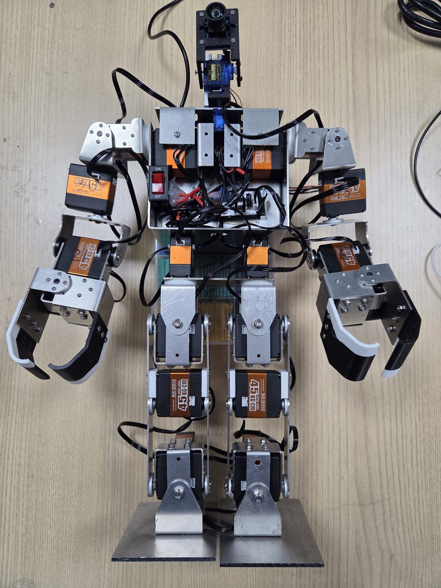
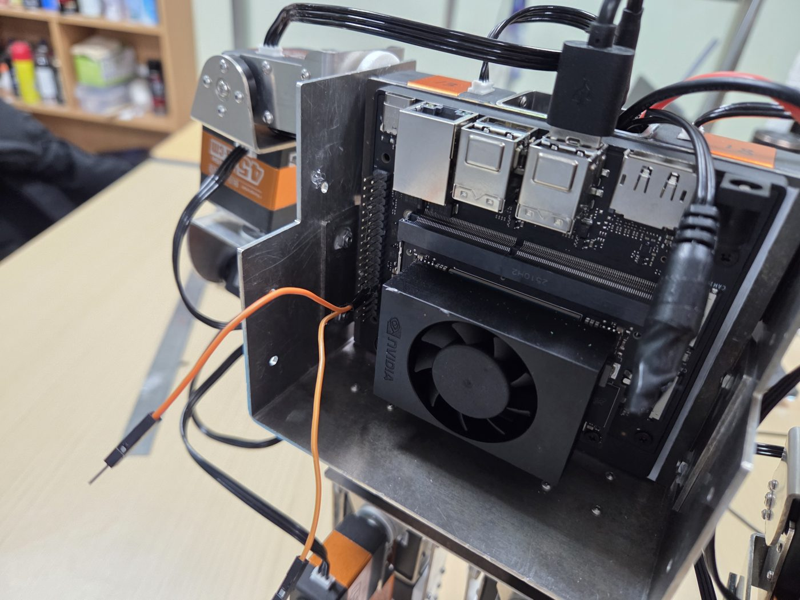
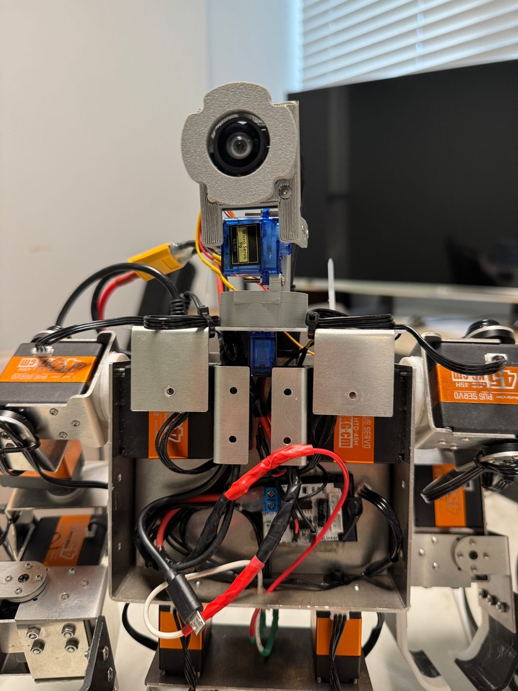

# Hardware Interface

!!! abstract "요약"
    - `ros2_control` 위에 직접 만든 하드웨어 플러그인 2개로 24관절을 구동한다.
    - 실제 로봇과 Gazebo가 **같은 URDF · 같은 컨트롤러 설정**을 공유한다.
    - 전환은 launch 인자 `use_sim` 하나로 한다.

## 구조

<div class="hw-hero" markdown>

```text
 상위 노드 (보행 · GUI · 미션)
        │  FollowJointTrajectory action / JointTrajectory topic
        ▼
 controller_manager (50 Hz)
   ├─ leg_controller  (12축)
   ├─ arm_controller  (10축)
   ├─ head_controller (2축)
   └─ joint_state_broadcaster → /joint_states
        │
        ├──▶ body_hardware : RHPHumanoidSystemHardware
        │      USB-TTL(/dev/ttyRHP) → Hiwonder HTD-45H × 22
        │
        └──▶ head_hardware : PWMHeadSystemHardware
               Jetson PWM(sysfs) → SG-90 × 2
```

<figure markdown="span">
  
  <figcaption>22축 휴머노이드</figcaption>
</figure>

</div>

## 하드웨어

| 구분 | 부품 | 사양 · 비고 |
|---|---|---|
| 메인 컴퓨터 | NVIDIA Jetson Orin Nano | Ubuntu 22.04 + ROS2 Humble |
| 몸체 관절 | Hiwonder HTD-45H 버스 서보 × 22 | 다리 12 · 팔 10 (그리퍼 포함). 0~1000 단위 / 240° |
| 서보 통신 보드 | Hiwonder TTL/USB Debugging Board | CH340, 115200 bps. 출력 2포트 → 만능기판으로 분배 |
| 머리 관절 | SG-90 PWM 서보 × 2 | pan / tilt. 레벨 컨버터 경유, 전원은 모터 보드 5V (GND 공유) |
| 안전 | 전원 스위치 | 비상정지 · 토크 해제용 |

<div class="photo-row photo-row--portrait-last" markdown>

<figure markdown="span">
  
  <figcaption>관절 이름 · 모터 ID</figcaption>
</figure>

<figure markdown="span">
  
  <figcaption>Jetson Orin Nano (등)</figcaption>
</figure>

<figure markdown="span">
  { .portrait }
  <figcaption>몸통 내부 · 전면 카메라</figcaption>
</figure>

</div>

!!! warning "Bus Servo Controller는 사용 불가"
    Hiwonder **Bus Servo Controller**는 PC에서 시리얼 포트가 아닌 **HID 장치**(`0483:5750`)로 인식된다.
    리눅스에서 `/dev/ttyUSB*`로 열 수 없으므로 **TTL/USB Debugging Board**를 쓴다.

## 패키지

**[`RHp_humanoid_resources`](https://github.com/RHplusLab/RHp_humanoid_resources)** — 로봇 모델 · 하드웨어

| 패키지 | 역할 |
|---|---|
| `rhphumanoid_description` | URDF/xacro, 메시, `ros2_control` 태그 → [Robot Description](description.md) |
| `rhphumanoid_hardware_interface` | 몸체(시리얼) · 머리(PWM) 플러그인 → [Hardware Plugin](interface.md) |
| `rhphumanoid_bringup` | 컨트롤러 YAML, 통합 launch |
| `rhphumanoid_gazebo` | Gazebo 월드 · GUI 설정 |

**[`RHp_humanoid_controller`](https://github.com/RHplusLab/RHp_humanoid_controller)** — 상위 제어 노드

| 패키지 | 역할 |
|---|---|
| `rhphumanoid_walking` | OP3 보행 알고리즘 이식, 사인파 기반 보행 → [Walking Pattern](../walk/index.md) |
| `rhphumanoid_walking_pattern` | 키프레임(자세 + 시간) 시퀀스 재생 |
| `rhphumanoid_arm_controller` · `rhphumanoid_head_controller` | 팔 · 머리 동작 |
| `scripts/motor_control_gui.py` | 관절별 슬라이더 실시간 제어 (PyQt5) |

## 실행

=== "실제 로봇"

    ```bash
    ros2 launch rhphumanoid_bringup rhphumanoid_bringup.launch.py
    ```

=== "Gazebo"

    ```bash
    ros2 launch rhphumanoid_bringup rhphumanoid_bringup.launch.py use_sim:=true
    ```

| 항목 | 실제 로봇 (`use_sim:=false`) | Gazebo (`use_sim:=true`) |
|---|---|---|
| 하드웨어 플러그인 | `RHPHumanoidSystemHardware` + `PWMHeadSystemHardware` | `gz_ros2_control/GazeboSimSystem` |
| controller_manager | `ros2_control_node` 직접 실행 | Gazebo 플러그인이 실행 |
| 컨트롤러 스폰 | `ros2_control_node` 시작 직후 | 5초 지연 |
| 카메라 | `usb_cam` 노드 | `ros_gz_bridge` |

## ros2_control을 쓰는 이유

| 선택지 | 판단 |
|---|---|
| OP3 `robotis_framework`를 Hiwonder 모터용으로 수정 | 프레임워크가 다이나믹셀에 묶여 있어 수정 범위가 큼 |
| **`ros2_control` + 자체 하드웨어 플러그인** | 7축 로봇팔과 같은 구조. 시뮬레이션 전환 쉬움 → **채택** |

- 참고한 공개 사례: PAL Robotics [TALOS](https://github.com/pal-robotics/talos_robot) — `ros2_control` 기반 휴머노이드
- 상용 휴머노이드가 자체 컨트롤러를 쓰는 이유: 특정 하드웨어 성능 극대화, 범용 프레임워크 오버헤드 제거

## 학습 순서

1. **[ros2_control_demos](https://github.com/ros-controls/ros2_control_demos)** — 개념 익히기

    ```bash
    git clone https://github.com/ros-controls/ros2_control_demos.git -b humble   # Jazzy: -b jazzy
    sudo apt install ros-humble-ros2-control ros-humble-ros2-controllers \
                     ros-humble-ros2-controllers-test-nodes
    ros2 launch ros2_control_demo_example_6 rrbot_modular_actuators.launch.py
    ros2 launch ros2_control_demo_example_6 test_forward_position_controller.launch.py   # 새 터미널
    ```

    - 예제 6: 관절마다 액추에이터가 따로 있는 구조 → 우리 로봇과 같음
    - 예제 9: Gazebo 연동

2. **[Robot Description](description.md)** — CAD → URDF, RViz 확인
3. **2축 하드웨어 검증** — 예제 6의 플러그인만 교체해 실제 모터 2개 구동
4. **22축 확장** → [Hardware Plugin](interface.md)
5. **Gazebo 연동** — 같은 URDF에 `GazeboSimSystem` 분기 추가

## 참고 자료

- [ros2_control 공식 문서](https://control.ros.org/humble/index.html)
- [gz_ros2_control](https://control.ros.org/humble/doc/gz_ros2_control/doc/index.html)
- [Hiwonder Bus Servo 문서](https://docs.hiwonder.com/projects/Bus-Servo-Controller/en/latest/)
- [ROBOTIS dynamixel_hardware_interface](https://github.com/ROBOTIS-GIT/dynamixel_hardware_interface) — 다이나믹셀용 ros2_control 플러그인 예시
