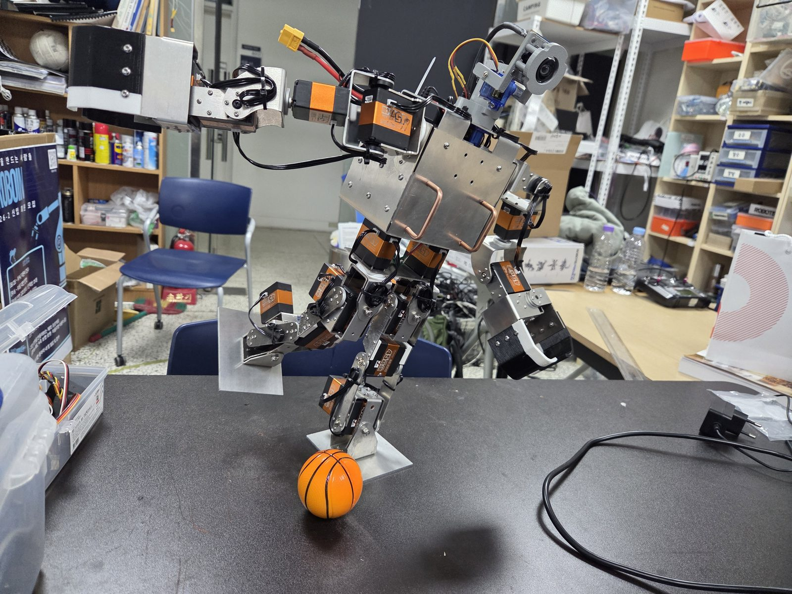

# Roboin Humanoid Plus Project

22-DoF Humanoid and 7-DoF Manipulator, controlled with ROS2

{ .hero }

[시작하기](install/index.md){ .md-button .md-button--primary }
[GitHub :material-github:](https://github.com/RHplusLab){ .md-button }

---

-   :material-robot-industrial: **22축 휴머노이드**

    ---

    - **기본 보행** — 발바닥 센서 없이 모션 재생 / 센서 기반 유동 제어
    - **승부차기** — 카메라로 공과 골대를 인식해 발로 차기
    - **물체 이동·투척** — 바닥의 물체를 집어 목표 지점에 놓기

-   :material-robot-outline: **7축 로봇팔**

    ---

    - **원격 조종** — 키보드 입력 + 카메라 영상 스트리밍
    - **Pick & Place** — 바닥의 공을 검출해 지정 위치로 (실패 시 재시도)
    - **블럭 쌓기** — AprilTag로 순서를 읽어 프로그래밍된 대로 적재

## 기술 스택

| 영역 | 사용 기술 |
|---|---|
| OS / 미들웨어 | Ubuntu 24.04, ROS2 |
| 제어 | `ros2_control`, custom `hardware_interface`, MoveIt2 |
| 작업 계획 | MoveIt Task Constructor (MTC) |
| 시뮬레이션 | Gazebo, RViz |
| 인식 | AprilTag, 6D Pose Estimation, Point Cloud |
| 보행 | ZMP 기반 보행 패턴 생성 |

## Documentation

-   **1 ·** [Installation](install/index.md)

    Ubuntu 24.04 + ROS2 설치, 워크스페이스 구성

-   **2 ·** [Hardware Interface](hw/index.md)

    URDF description 패키지와 `ros2_control` 하드웨어 인터페이스

-   **3 ·** [Arena Setup](arena.md)

    1.5 m × 3 m 경기장과 미션 구성

-   **4 ·** [High Level Control](vision/index.md)

    카메라로 물체를 찾아 제어로 넘기기

-   **5 ·** [Walking Pattern](walk/index.md)

    ZMP 기반 보행 패턴 생성

-   **6 ·** [RL Control](rl.md)

    강화학습 기반 제어

-   **7 ·** [Task Generation](task/index.md)

    MoveIt2 · MTC로 작업 시퀀스 구성

-   :material-school: [Learning Path](study/index.md)

    제어 이론 커리큘럼과 트러블슈팅 모음

---

연세대학교 기계공학부 로봇동아리 **Roboin** · 2025.03 ~
