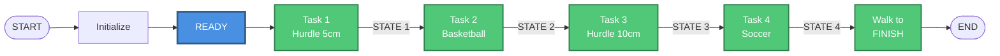

# Task Generation

!!! abstract "요약"
    - 휴머노이드가 경기장 미션을 수행하도록 **보행 · 미션 동작을 순서대로 엮는** 계층
    - 경기장 코스: 허들 → 농구 → 허들 → 축구
    - 미션 로직: **상태 기계**로 설계 — 경로 주행 → 정밀 정렬 → 동작 실행 → 확인 · 재시도
    - 현재: 상태 기계 설계, 키프레임 동작 시퀀스 구현. 인식 → 동작 연결은 작업 중

## 경기장 코스

팀 자체 규정 (기존 대회 규정을 참고해 작성)

```text
 START → ① 허들 (5 cm) → ② 농구 → ③ 허들 (10 cm) → ④ 축구 → FINISH
```

| 미션 | 내용 | 점수 |
|---|---|---|
| ① · ③ 허들 | **전진 보행**으로 넘기. 넘어뜨리기 · 옆걸음으로 넘기 · 건너뛰기는 실격 | — |
| ② 농구 | 공 지지대(높이 3 cm) 위의 공(지름 7 cm 스펀지)을 집어 골대에 넣기. 방법 자유 | 골 +1 / 림 접촉 −1 |
| ④ 축구 | 공 지지대 위의 공을 드리블해 **하체로** 슛 | 골 +1 / 골대 접촉 · 상체로 공 접촉 −1 |

- 자율 주행, 경기 중 조작 · 접촉 금지, 제한 시간 10분
- 바닥 유도선(흰색 점선)을 따라 이동, 경로 이탈 시 종료
- 순위: 미션 점수(−2 ~ +2) → 총 이동 거리 → 시간
- 축구 후 결승선까지 걸어가기
- 경기장 규격 · 제작 → [Arena Setup](../arena.md)

## 미션 상태 기계 (설계)

!!! note "설계 단계"
    아래 순서도는 미션 수행 로직의 **설계안**이다. 허용 오차 · 재시도 횟수 · 동작 이름은 계획값이며 구현 기록은 아직 없다.

### 전체 흐름



- 초기화: 초기 자세 설정, 경로 웨이포인트 정의, 동작 파라미터 로드
- 미션 하나를 끝낼 때마다 상태(STATE 1~4)가 넘어가고, 다음 미션은 이전 상태에서 시작

모든 미션은 같은 틀을 따른다.

```text
경로 주행 (Navigation) → 정밀 정렬 (Fine Alignment) → 동작 실행 → 성공 확인 → 실패 시 복구 · 재시도 (최대 3회)
```

| 미션 | 정렬 대상 · 허용 오차 | 실행 동작 | 성공 판정 |
|---|---|---|---|
| ① 허들 (5 cm) | 파란 허들 중심 — 거리 15~20 cm, 좌우 ±2 cm, 각도 ±5° | JUMP | 착지 후 IMU 안정 |
| ② 농구 | ⓐ 지지대 위 공 — 거리 10~12 cm, ±1 cm<br/>ⓑ 분홍 골대 입구 — 거리 20~25 cm, ±2 cm | PICK UP → PLACE | 비전으로 파지 · 골인 확인 |
| ③ 허들 (10 cm) | 보라 허들 중심 — ①과 동일 | JUMP HIGH (①보다 큰 힘) | 착지 후 IMU 안정 |
| ④ 축구 | ⓐ 바닥의 공 — 거리 8~12 cm, ±1 cm<br/>ⓑ 초록 골대 입구 — 각도 ±3° | KICK | 공이 골대 안 |

### 공통 모듈

=== "경로 주행 (Navigation)"

    ```mermaid
    flowchart TD
        Start([Start Navigation<br/>Input: Target Waypoint]) --> Navigate[Navigate Toward Waypoint<br/>- Use odometry<br/>- Use visual landmarks<br/>- Move forward]
        Navigate --> CheckBound{Path<br/>Deviation?<br/>Outside corridor?}
        CheckBound -->|Yes: Out of bounds| Stop[Emergency Stop<br/>Stop all forward motion]
        Stop --> DetectDir[Detect Deviation Direction<br/>- Check floor boundaries<br/>- Check visual markers]
        DetectDir --> Rotate[Rotate Toward Path Center<br/>- Turn left/right<br/>- Face centerline]
        Rotate --> SideStep[Side-Step Correction<br/>- Move laterally<br/>- Return to corridor]
        SideStep --> CheckReturn{Back in<br/>corridor?}
        CheckReturn -->|No| SideStep
        CheckReturn -->|Yes| Navigate
        CheckBound -->|No: On path| CheckDist{Arrived at<br/>Waypoint?<br/>Distance < 5cm}
        CheckDist -->|No| Navigate
        CheckDist -->|Yes| Complete([Navigation Complete<br/>Proceed to Fine Alignment])

        classDef navClass fill:#50C878,stroke:#2E7D4E,stroke-width:2px,color:#fff
        classDef checkClass fill:#FF6B6B,stroke:#CC5555,stroke-width:2px,color:#fff
        classDef correctClass fill:#E74C3C,stroke:#C0392B,stroke-width:2px,color:#fff
        class Navigate,DetectDir,Rotate,SideStep navClass
        class CheckBound,CheckDist,CheckReturn checkClass
        class Stop correctClass
    ```

    - 경로 이탈 시 정지 → 이탈 방향 판단 → 회전 → 옆걸음으로 복귀
    - 웨이포인트 5 cm 이내 도착 시 정밀 정렬로 넘어감

=== "정밀 정렬 (Fine Alignment)"

    ```mermaid
    flowchart TD
        Start([Start Fine Alignment<br/>Input: Target Object]) --> Detect[Detect Target Object<br/>- Use vision system<br/>- Get position & angle]
        Detect --> Found{Object<br/>Detected?}
        Found -->|No| Detect
        Found -->|Yes| CalcError[Calculate Position Error<br/>- ΔY: lateral offset<br/>- ΔX: distance offset<br/>- Δθ: angle offset]
        CalcError --> CheckX{ΔY within 2cm?<br/>Lateral aligned?}
        CheckX -->|No| AdjustX[Micro-Adjust Lateral<br/>- Side-step left/right<br/>- Step size: 1cm]
        AdjustX --> Detect
        CheckX -->|Yes| CheckY{ΔX within 2cm?<br/>Distance correct?}
        CheckY -->|No| AdjustY[Micro-Adjust Distance<br/>- Step forward/backward<br/>- Step size: 1cm]
        AdjustY --> Detect
        CheckY -->|Yes| CheckTheta{Δθ within 5°?<br/>Angle aligned?}
        CheckTheta -->|No| AdjustTheta[Micro-Adjust Rotation<br/>- Rotate left/right<br/>- Step size: 2-3°]
        AdjustTheta --> Detect
        CheckTheta -->|Yes| FinalVerify[Final Verification<br/>- Check all criteria again<br/>- Confirm target centered<br/>- Confirm stable position]
        FinalVerify --> AllGood{All criteria<br/>satisfied?}
        AllGood -->|No| Detect
        AllGood -->|Yes| Complete([Alignment Complete<br/>Ready for Motion Execution])

        classDef alignClass fill:#FFB347,stroke:#CC8A38,stroke-width:2px,color:#000
        classDef checkClass fill:#FF6B6B,stroke:#CC5555,stroke-width:2px,color:#fff
        class Detect,CalcError,AdjustX,AdjustY,AdjustTheta,FinalVerify alignClass
        class Found,CheckX,CheckY,CheckTheta,AllGood checkClass
    ```

    - 좌우(ΔY) → 거리(ΔX) → 각도(Δθ) 순서로 하나씩 맞춤
    - 보정 단위: 옆걸음 · 앞뒤 1 cm, 회전 2~3°

### 미션별 순서도

=== "① 허들 (5 cm)"

    ```mermaid
    flowchart TD
        Start([Task 1 Start<br/>STATE 0]) --> Nav[Navigate to Waypoint 1<br/>Target: Pre-Hurdle Position<br/>Use Navigation Module]
        Nav --> Align[Fine Alignment<br/>Target: Blue Hurdle Center<br/>- Distance: 15-20cm<br/>- Center aligned: ±2cm<br/>- Angle: ±5°]
        Align --> Execute[Execute Motion: JUMP<br/>- Trigger pre-programmed jump<br/>- Clear 5cm hurdle<br/>- No feedback during execution]
        Execute --> CheckLanding{Landing<br/>Successful?<br/>IMU stable?}
        CheckLanding -->|No: Fall/Unstable| Recover[Recovery Protocol<br/>- Stabilize robot<br/>- Return to Waypoint 1<br/>- Retry count +1]
        Recover --> MaxRetry{Retry count<br/>< 3?}
        MaxRetry -->|No| Fail([Task Failed<br/>Manual intervention])
        MaxRetry -->|Yes| Align
        CheckLanding -->|Yes: Stable| Complete([Task 1 Complete<br/>STATE 1: HURDLE 1 CLEARED])

        classDef navClass fill:#50C878,stroke:#2E7D4E,stroke-width:2px,color:#fff
        classDef alignClass fill:#FFB347,stroke:#CC8A38,stroke-width:2px,color:#000
        classDef execClass fill:#9B59B6,stroke:#7D3C98,stroke-width:3px,color:#fff
        classDef checkClass fill:#FF6B6B,stroke:#CC5555,stroke-width:2px,color:#fff
        class Nav navClass
        class Align alignClass
        class Execute execClass
        class CheckLanding,MaxRetry checkClass
    ```

=== "② 농구"

    ```mermaid
    flowchart TD
        Start([Task 2 Start<br/>STATE 1]) --> Nav1[Navigate to Waypoint 2<br/>Target: Pre-Ball Position<br/>Use Navigation Module]
        Nav1 --> Align1[Fine Alignment A<br/>Target: Ball on Holder<br/>- Distance: 10-12cm<br/>- Ball centered: ±1cm<br/>- Gripper aligned]
        Align1 --> Exec1[Execute Motion: PICK UP<br/>- Trigger grasp motion<br/>- Close gripper<br/>- Lift to carry position]
        Exec1 --> Check1{Grasp<br/>Successful?<br/>Vision verify}
        Check1 -->|No: Ball dropped| Recover1[Recovery Protocol<br/>- Open gripper<br/>- Return to Waypoint 2<br/>- Retry count +1]
        Recover1 --> MaxRetry1{Retry count<br/>< 3?}
        MaxRetry1 -->|No| Fail([Task Failed])
        MaxRetry1 -->|Yes| Align1
        Check1 -->|Yes: Ball held| SubState[Sub-State: Ball Held<br/>Navigate to Waypoint 3<br/>Target: Pre-Hoop Position]
        SubState --> Align2[Fine Alignment B<br/>Target: Pink Hoop Opening<br/>- Distance: 20-25cm<br/>- Hoop centered: ±2cm<br/>- Height aligned]
        Align2 --> Exec2[Execute Motion: PLACE<br/>- Trigger placement motion<br/>- Move ball to hoop<br/>- Open gripper]
        Exec2 --> Check2{Placement<br/>Successful?<br/>Vision verify}
        Check2 -->|No: Ball missed| Recover2[Recovery Protocol<br/>- Locate ball<br/>- Pick up again<br/>- Retry count +1]
        Recover2 --> MaxRetry2{Retry count<br/>< 3?}
        MaxRetry2 -->|No| Fail
        MaxRetry2 -->|Yes| Align2
        Check2 -->|Yes: Ball in hoop| Complete([Task 2 Complete<br/>STATE 2: BASKETBALL CLEARED])

        classDef navClass fill:#50C878,stroke:#2E7D4E,stroke-width:2px,color:#fff
        classDef alignClass fill:#FFB347,stroke:#CC8A38,stroke-width:2px,color:#000
        classDef execClass fill:#9B59B6,stroke:#7D3C98,stroke-width:3px,color:#fff
        classDef checkClass fill:#FF6B6B,stroke:#CC5555,stroke-width:2px,color:#fff
        class Nav1,SubState navClass
        class Align1,Align2 alignClass
        class Exec1,Exec2 execClass
        class Check1,Check2,MaxRetry1,MaxRetry2 checkClass
    ```

=== "③ 허들 (10 cm)"

    ```mermaid
    flowchart TD
        Start([Task 3 Start<br/>STATE 2]) --> Nav[Navigate to Waypoint 4<br/>Target: Pre-Hurdle Position<br/>Use Navigation Module]
        Nav --> Align[Fine Alignment<br/>Target: Purple Hurdle Center<br/>- Distance: 15-20cm<br/>- Center aligned: ±2cm<br/>- Angle: ±5°]
        Align --> Execute[Execute Motion: JUMP HIGH<br/>- Trigger pre-programmed jump<br/>- Clear 10cm hurdle<br/>- Higher power than Task 1]
        Execute --> CheckLanding{Landing<br/>Successful?<br/>IMU stable?}
        CheckLanding -->|No: Fall/Unstable| Recover[Recovery Protocol<br/>- Stabilize robot<br/>- Return to Waypoint 4<br/>- Retry count +1]
        Recover --> MaxRetry{Retry count<br/>< 3?}
        MaxRetry -->|No| Fail([Task Failed])
        MaxRetry -->|Yes| Align
        CheckLanding -->|Yes: Stable| Complete([Task 3 Complete<br/>STATE 3: HURDLE 2 CLEARED])

        classDef navClass fill:#50C878,stroke:#2E7D4E,stroke-width:2px,color:#fff
        classDef alignClass fill:#FFB347,stroke:#CC8A38,stroke-width:2px,color:#000
        classDef execClass fill:#9B59B6,stroke:#7D3C98,stroke-width:3px,color:#fff
        classDef checkClass fill:#FF6B6B,stroke:#CC5555,stroke-width:2px,color:#fff
        class Nav navClass
        class Align alignClass
        class Execute execClass
        class CheckLanding,MaxRetry checkClass
    ```

=== "④ 축구"

    ```mermaid
    flowchart TD
        Start([Task 4 Start<br/>STATE 3]) --> Nav1[Navigate to Waypoint 5<br/>Target: Pre-Ball Position<br/>Use Navigation Module]
        Nav1 --> Align1[Fine Alignment A<br/>Target: Ball on Ground<br/>- Distance: 8-12cm<br/>- Ball at kick position: ±1cm<br/>- Kicking foot aligned]
        Align1 --> Align2[Fine Alignment B<br/>Target: Green Goal Opening<br/>- Detect goal center<br/>- Calculate kick angle<br/>- Rotate to goal: ±3°]
        Align2 --> Verify{Both targets<br/>aligned?<br/>Ball + Goal}
        Verify -->|No| Align2
        Verify -->|Yes| Execute[Execute Motion: KICK<br/>- Trigger kick motion<br/>- Strike ball toward goal<br/>- Follow through]
        Execute --> Check{Kick<br/>Successful?<br/>Ball in goal?}
        Check -->|No: Ball missed| Recover[Recovery Protocol<br/>- Locate ball<br/>- Re-approach ball<br/>- Retry count +1]
        Recover --> MaxRetry{Retry count<br/>< 3?}
        MaxRetry -->|No| Fail([Task Failed])
        MaxRetry -->|Yes| Nav1
        Check -->|Yes: Goal scored| Complete([Task 4 Complete<br/>STATE 4: MISSION COMPLETE])

        classDef navClass fill:#50C878,stroke:#2E7D4E,stroke-width:2px,color:#fff
        classDef alignClass fill:#FFB347,stroke:#CC8A38,stroke-width:2px,color:#000
        classDef execClass fill:#9B59B6,stroke:#7D3C98,stroke-width:3px,color:#fff
        classDef checkClass fill:#FF6B6B,stroke:#CC5555,stroke-width:2px,color:#fff
        class Nav1 navClass
        class Align1,Align2 alignClass
        class Execute execClass
        class Verify,Check,MaxRetry checkClass
    ```

## 동작 시퀀스 구성

보행 · 미션 동작을 **키프레임 시퀀스**로 정의하고, 상위 노드가 필요한 시퀀스를 순서대로 호출하는 구조다.
[`rhphumanoid_walking_pattern`](https://github.com/RHplusLab/RHp_humanoid_controller/tree/main/rhphumanoid_walking_pattern)

```cpp
struct MotionStep {
  std::vector<double> positions;   // 관절 12개 목표 각도 (rad)
  double move_time;                // 도달 시간 (s)
  double stop_time;                // 도달 후 정지 시간 (s)
};

const std::vector<MotionStep> SEQ_WALK_FORWARD = {
  { POSE_LEFT_UP,  0.5, 0.1 },
  { POSE_STAND,    0.5, 0.1 },
  { POSE_RIGHT_UP, 0.5, 0.1 },
  { POSE_STAND,    0.5, 0.1 },
};
// SEQ_TURN_LEFT, SEQ_WALK_BACKWARD …
```

- 각 `MotionStep`을 `/leg_controller/follow_joint_trajectory` action goal 하나로 보내고, 결과를 받으면 다음 단계로 넘어간다.
- "앞으로 2번 → 왼쪽 3번"처럼 시퀀스를 이어 붙여 미션 경로를 만든다.
- 시퀀스 편집용 GUI(관절 슬라이더 → 장면 저장 → YAML 출력) 개발 중

## 진행 상태

| 단계 | 상태 |
|---|---|
| 22축 하드웨어 인터페이스 · 컨트롤러 | 완료 → [Hardware Interface](../hw/index.md) |
| 키프레임 보행 시퀀스 (전진 · 후진 · 회전) | 기본 동작 구현 |
| 사인파 기반 연속 보행 (OP3 이식) | 구현 → [Walking Pattern](../walk/index.md) |
| 미션 상태 기계 | 설계 완료 (위 순서도) |
| 허들 인식 → 이동 · 회전 결정 | 기본 코드 작성 중 → [High Level Control](../vision/index.md) |
| 미션별 동작 (JUMP · PICK UP · PLACE · KICK) | 기록 없음 |
